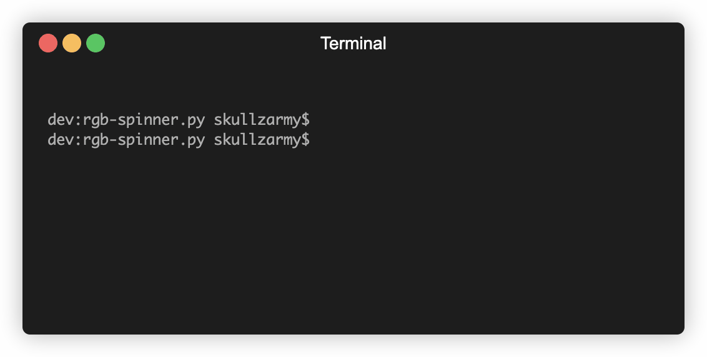

# Entirely Over-Engineered RGB Spinner (for Python)



## Why?

Indeed...

## How?

Mostly lifted from Stack Overflow and went from there. [https://stackoverflow.com/a/39504463](https://stackoverflow.com/a/39504463)

## How to use

If you really want to, you can ensure you have the needed dependencies

```python
import sys
import threading
import time
```

Then define the Spinner class somewhere in your code:

```python
class Spinner:
    busy = False
    delay = 0.15
    colors = [(255, 0, 0), (255, 128, 0), (255, 255, 0), (0, 255, 0), (0, 0, 255), (75, 0, 130), (148, 0, 211)]
    color_index = 0

    @staticmethod
    def spinning_cursor():
        while True:
            for cursor in '|/-\\':
                yield cursor

    def __init__(self, delay=None):
        self.spinner_generator = self.spinning_cursor()
        if delay and float(delay):
            self.delay = delay

    def spinner_task(self):
        while self.busy:
            cursor = next(self.spinner_generator)
            color = self.colors[self.color_index]
            self.color_index = (self.color_index + 1) % len(self.colors)
            sys.stdout.write('\033[38;2;{};{};{}m{}\033[0m'.format(color[0], color[1], color[2], cursor))
            sys.stdout.flush()
            time.sleep(self.delay)
            sys.stdout.write('\b')
            sys.stdout.flush()

    def __enter__(self):
        self.busy = True
        threading.Thread(target=self.spinner_task).start()

    def __exit__(self, exception, value, tb):
        self.busy = False
        time.sleep(self.delay)
        if exception is not None:
            return False
        sys.stdout.flush()
```

Then invoke it somewhere:

```python
with Spinner():
    # Do things...
```
